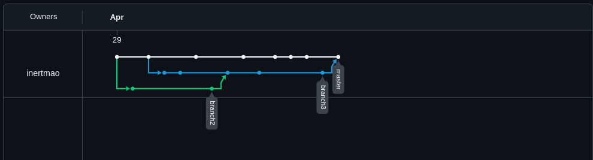
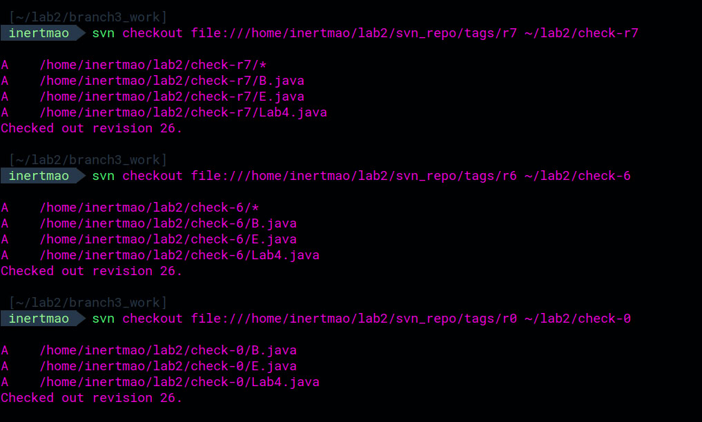
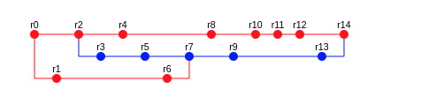

# Лабораторная работа №2: Конфигурация репозиториев SVN и Git


**Студент:** Шахзод Исмоилов  
**Дата:** \today

## Задание
Сконфигурировать в домашнем каталоге репозитории SVN и Git, загрузить в них начальные файлы исходного кода и воспроизвести последовательность операций согласно предоставленной блок-схеме ветвлений и коммитов (r0–r14).

---

## Список команд

### Git
Ниже представлен Bash-скрипт для инициализации Git-репозитория, создания веток, выполнения коммитов и тегирования (r0–r14):

```bash
#!/bin/bash
set -e

# 1. Инициализация репозитория и настройки
git init
git remote add origin https://github.com/inertmao/Lab2Opi.git
echo -e "\n[merge]\n\ttool = nano" >> .git/config

# Пользователь red для "красных" ревизий
git config user.name "red"
git config user.email "red@example.com"

# r0: Initial commit (red)
unzip -o commits/commit0.zip -d src
git add src
git commit -m "r0 Initial commit (red)"
git tag r0
git push -u origin master

# r1, r6: ветка branch2 (red)
git checkout -b branch2 r0
unzip -o commits/commit1.zip -d src
git add src
git commit -m "r1 (red)"
git tag r1
unzip -o commits/commit6.zip -d src
git add src
git commit -m "r6 (red)"
git tag r6
git push -u origin branch2

# r2, r4, r8, r10, r11, r12: master (red)
git checkout master
for n in 2 4 8 10 11 12; do
  unzip -o commits/commit${n}.zip -d src
  git add src
  git commit -m "r${n} (red)"
  git tag r${n}
done
git push origin master

# r3, r5, r7, r9, r13: branch3 (blue)
git checkout -b branch3 r2
git config user.name "blue"
git config user.email "blue@example.com"
for n in 3 5; do
  unzip -o commits/commit${n}.zip -d src
  git add src
  git commit -m "r${n} (blue)"
  git tag r${n}
done

# r7: merge branch2 → branch3 + изменения
git merge --no-ff --no-commit branch2
unzip -o commits/commit7.zip -d src
git add src
git commit -m "r7 (blue) Merge branch2 into branch3 + changes"
git tag r7

# Продолжение для r9, r13
for n in 9 13; do
  unzip -o commits/commit${n}.zip -d src
  git add src
  git commit -m "r${n} (blue)"
  git tag r${n}
done
git push origin branch3

# r14: merge branch3 → master
git checkout master
git merge --no-ff branch3 -m "r14 (red) Merge branch3 into master"
git tag r14
git push origin master
```  

---

### SVN
Ниже представлен Bash-скрипт для инициализации SVN-репозитория, создания веток, выполнения коммитов и тегирования (r0–r14):

```bash
# 0) Создание репозитория
svnadmin create /home/inertmao/lab2/svn_repo

# 1) Инициализация структуры trunk, branches, tags
svn mkdir --parents \
  file:///home/inertmao/lab2/svn_repo/trunk \
  file:///home/inertmao/lab2/svn_repo/branches \
  file:///home/inertmao/lab2/svn_repo/tags \
  -m "Initialize repository structure" --username red

# 2) r0: импорт initial snapshot в trunk
unzip -o /home/inertmao/Desktop/opi/Lab2Opi/commits/commit0.zip -d /tmp/svn-import
svn import /tmp/svn-import file:///home/inertmao/lab2/svn_repo/trunk \
  -m "r0 Initial import (red)" --username red
rm -rf /tmp/svn-import

# 3) Tag r0
svn copy file:///home/inertmao/lab2/svn_repo/trunk \
  file:///home/inertmao/lab2/svn_repo/tags/r0 \
  -m "Tag r0" --username red

# 4) Checkout trunk
svn checkout file:///home/inertmao/lab2/svn_repo/trunk /home/inertmao/lab2/svn_work

# 5) Создание branch2 из r0
svn copy file:///home/inertmao/lab2/svn_repo/tags/r0 \
  file:///home/inertmao/lab2/svn_repo/branches/branch2 \
  -m "Create branch2 from r0" --username red
svn checkout file:///home/inertmao/lab2/svn_repo/branches/branch2 /home/inertmao/lab2/branch2_work

# 6) r1: коммит в branch2
dd=/home/inertmao/lab2/branch2_work
cd $dd
unzip -o /home/inertmao/Desktop/opi/Lab2Opi/commits/commit1.zip -d .
svn add --force .
svn commit -m "r1 (red)" --username red

# 7) Tag r1
svn copy file:///home/inertmao/lab2/svn_repo/branches/branch2 \
  file:///home/inertmao/lab2/svn_repo/tags/r1 -m "Tag r1" --username red

# 8) r2: коммит в trunk
cd /home/inertmao/lab2/svn_work
svn update
unzip -o /home/inertmao/Desktop/opi/Lab2Opi/commits/commit2.zip -d .
svn add --force .
svn commit -m "r2 (red)" --username red

# 9) Tag r2
svn copy file:///home/inertmao/lab2/svn_repo/trunk \
  file:///home/inertmao/lab2/svn_repo/tags/r2 -m "Tag r2" --username red

# 10) Создание branch3 из r2
svn copy file:///home/inertmao/lab2/svn_repo/trunk \
  file:///home/inertmao/lab2/svn_repo/branches/branch3 \
  -m "Create branch3 from r2" --username blue
svn checkout file:///home/inertmao/lab2/svn_repo/branches/branch3 /home/inertmao/lab2/branch3_work

# 11) r3: коммит в branch3
cd /home/inertmao/lab2/branch3_work
unzip -o /home/inertmao/Desktop/opi/Lab2Opi/commits/commit3.zip -d .
svn add --force .
svn commit -m "r3 (blue)" --username blue

# 12) Tag r3
svn copy file:///home/inertmao/lab2/svn_repo/branches/branch3 \
  file:///home/inertmao/lab2/svn_repo/tags/r3 -m "Tag r3" --username blue

# ... (далее аналогично до r14) ...
```  

---

## Тестовые скриншоты

### Git


### SVN


---

## Выводы
- Инициализация и настройка Git/SVN-репозиториев  
- Управление пользователями и ветвлением  
- Использование тегов для фиксации ревизий  
- Merge-коммиты с несколькими родителями  
- Применение аналогичных операций в SVN

---

## Блок-схема


